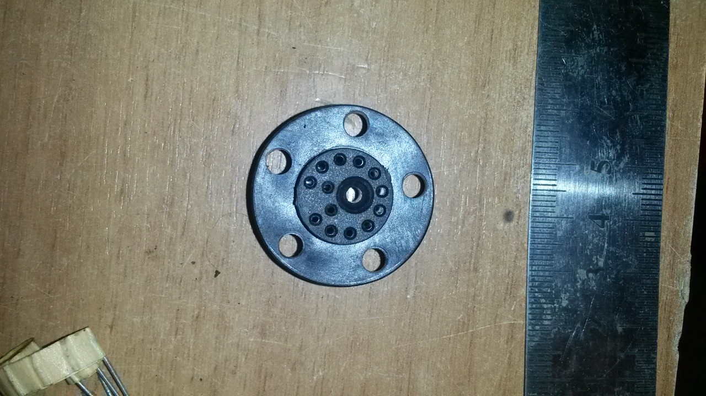
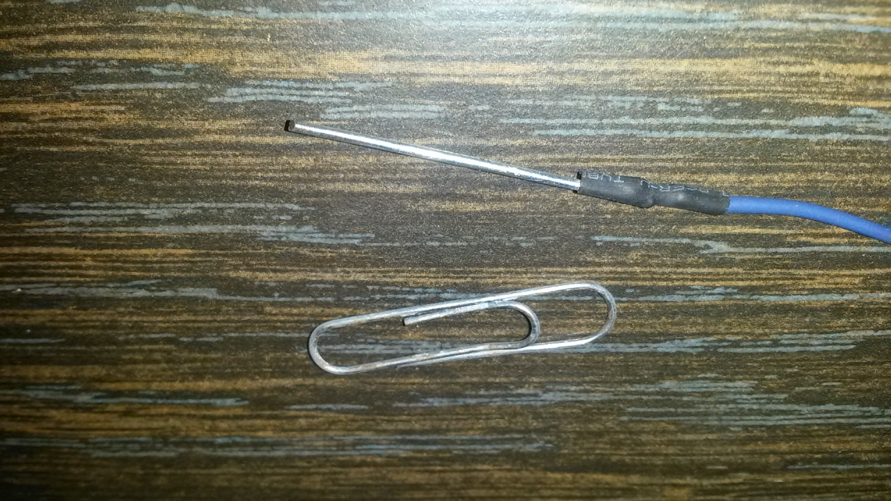
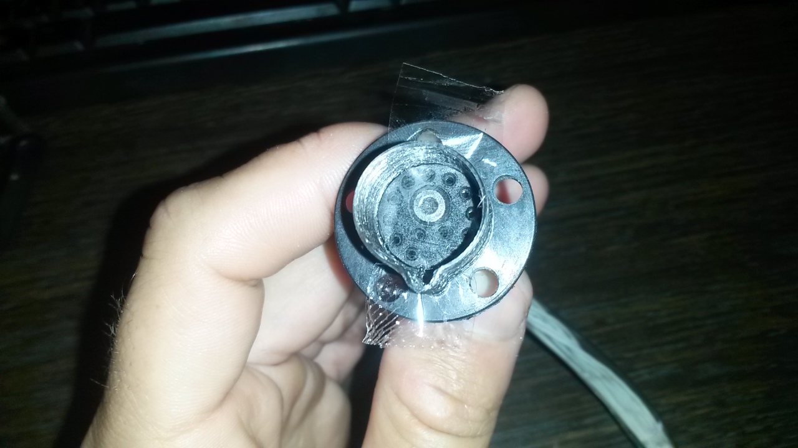
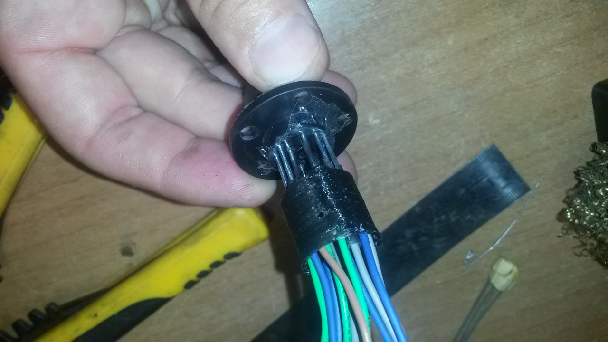
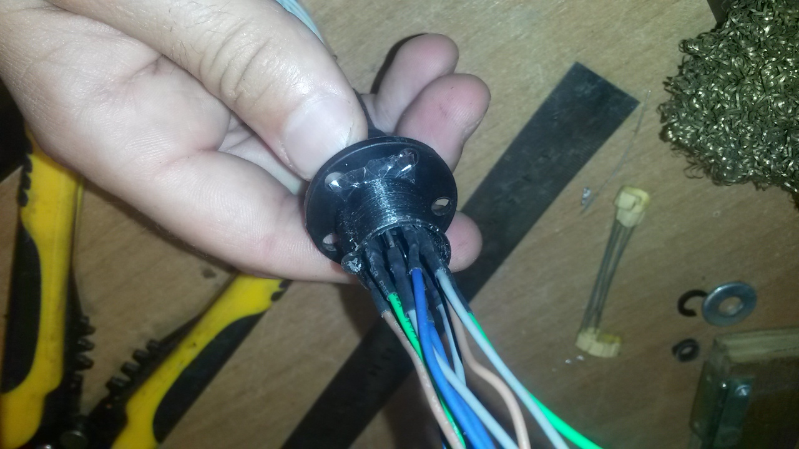

Extract the female plastic SPI connector from your wheelbase

And the wired connector that connects to the wheelbase PCB

Use the small ellen screw (that you had to remove) to assemble the two pieces back together.

solder some pins on pieces of wires (I recommend you to get something golden. I was lazy! It might rust out eventually!)

The connector has 13 connections, but you probably won't need all of them. However adding more will be impossible later. So I just did all of them.

[3d print this part](3d%20Models/Fanatec%20SPI%20connector/fanatec%20SPI%20connector-housing.STL)

put a small piece of adhesive tape to cover all the holes of the female plastic part. (don't use anything fancy, if it's really sticky mess it up a ittle bit with some finger oil - touch the sticky side.)
The 3d printed part should fit with the aligning indentation mark as shown in the photo. (indentation pointing down, Allen screw is at the top) See that it fits, and take it off.

force all the pins through the adhesive tape.

put the 3d plastic part back to its place

you are now ready to cast your connector in Epoxy resin.
Use 2 hours cure time epoxy, or you are not likely to fill in all the air gaps by the time the epoxy sets.
I only had 5 minutes epoxy lying around, so I have to do it in another time... to be continued.
(after the epoxy sets, release your new connector, and probably break the 3d printed part where it overlapped with the connector.)
